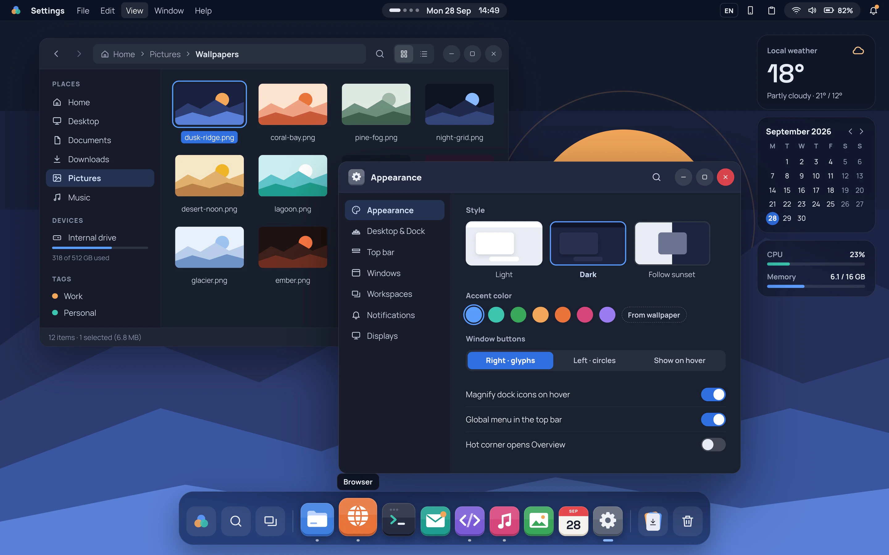
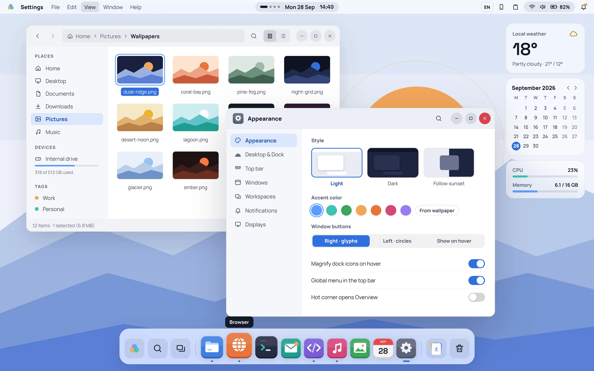

# Plasma Fusion

[](https://github.com/archledger/plasma-fusion/actions/workflows/build.yml)
[](https://scorecard.dev/viewer/?uri=github.com/archledger/plasma-fusion)
[](https://www.bestpractices.dev/projects/15168)

A KDE Plasma 6 desktop built from the Plasma Fusion design concept: ideas from macOS,
GNOME and Windows 11 on top of Plasma's Global Theme structure, in a dark and a light scheme,
with a tablet posture for convertibles.

<table>
<tr>
<td><a href="design/previews/Main.webp"></a></td>
<td><a href="design/previews/MainLight.webp"></a></td>
</tr>
</table>

These are design boards, the reference for every colour, size and drawing used here. All 25
boards are pictured in [`design/`](design/README.md), with their canvas sources in
`design/boards/`.

## Status

Experimental. Built for and tested on Fedora 44 KDE (Plasma 6.7.5, KDE Frameworks 6.30,
Qt 6.11) on a ThinkPad X13 Yoga Gen 4 convertible and an ASUS Zenbook laptop. Other
distributions and Plasma versions are not tested. Everything it changes can be undone with
`tools/device/fusion-restore.sh`.

## What it contains

- Global Themes (dark and light), Plasma style, colour schemes, icon and cursor themes,
  wallpapers, fonts (Manrope, Space Grotesk), boot splash and login screen styling
- Window decoration (Aurorae, and a compiled KDecoration3 plugin)
- Shell: top bar with a clock pill and app menu, dock, centred launcher, quick settings and
  Notification Centre, desktop cards
- Tablet posture: full-screen apps, home screen with app pages, gestures from the bottom edge,
  split screen, on-screen keyboard keys, pen menu
- App icons: 407 KDE, GNOME and common Linux apps redrawn as Plasma Fusion tiles that keep each app's
  own mark; every other installed app's own icon placed on a Plasma Fusion tile
- A settings module, a lock screen, power tiers for battery life

Each part is described in `docs/parts/`; the overall plan and decisions are in `docs/PLAN.md`.

## Quick start

You need Fedora 44 KDE (Plasma 6.7) and a few minutes. Apart from the build's Python modules,
everything happens in your own account, and a backup is taken first.

```sh
sudo dnf install git python3-pillow python3-pyside6     # the build's Python modules
git clone https://github.com/archledger/plasma-fusion
cd plasma-fusion
tools/build.sh                                       # build every part into stage/home
tools/device/fusion-config.sh --install stage/home   # in a terminal of your Plasma session
```

Then log out and back in once. `tools/device/fusion-config.sh --help` lists the options (light
scheme, keep your panel layout, `--dry-run` to see every change first). To undo everything:

```sh
tools/device/fusion-restore.sh                       # back to the state before Plasma Fusion
```

How the parts fit together is in [`docs/ARCHITECTURE.md`](docs/ARCHITECTURE.md).

RPMs for Fedora: `packaging/build-rpm.sh` builds the `plasma-fusion` package; the compiled
parts (`packages/navigation-cpp`, `packages/decoration-cpp`, `packages/kcm-cpp`: the tablet
gestures, the compiled window decoration and the settings module, which the quick start leaves
out) have their own spec files and container builds.

## Contributing

Bug reports, fixes and ideas are welcome: see [`CONTRIBUTING.md`](CONTRIBUTING.md). Security
problems go privately, as [`SECURITY.md`](SECURITY.md) explains.

## Project documents

| Document | What it says |
|---|---|
| [`CONTRIBUTING.md`](CONTRIBUTING.md) | how to report and change things, the coding standards |
| [`CODE_OF_CONDUCT.md`](CODE_OF_CONDUCT.md) | the Contributor Covenant 2.1 and whom to contact |
| [`GOVERNANCE.md`](GOVERNANCE.md) | how decisions are made, roles, continuity |
| [`SECURITY.md`](SECURITY.md) | how to report a vulnerability and how reports are handled |
| [`docs/ROADMAP.md`](docs/ROADMAP.md) | what the next year is meant to bring, and what is left out |
| [`docs/ARCHITECTURE.md`](docs/ARCHITECTURE.md) | the parts, how they are built and installed, where state lives |
| [`docs/SECURITY-ASSURANCE.md`](docs/SECURITY-ASSURANCE.md) | what you can and cannot expect in security, and why |
| [`docs/PLAN.md`](docs/PLAN.md), [`docs/parts/`](docs/parts/) | the build plan, decisions and one page per part |

## Licence

Plasma Fusion follows KDE's licensing policy:

| Part | Licence |
|---|---|
| Code (widgets, KWin scripts and effects, settings module, decoration, tools) | GPL-2.0-or-later |
| Files kept from KDE's own sources (parts of the desktop, lock screen and task switcher) | their original licence (GPL-2.0-or-later or LGPL-2.0-or-later) |
| Artwork and documentation | CC-BY-SA-4.0 |
| Metadata and plain data | CC0-1.0 |
| Bundled fonts (Manrope, Space Grotesk) | OFL-1.1, by their authors |

Every file states its licence in an SPDX header or in `REUSE.toml`; the licence texts are in
`LICENSES/`. The project is [REUSE](https://reuse.software) compliant (`reuse lint`).
